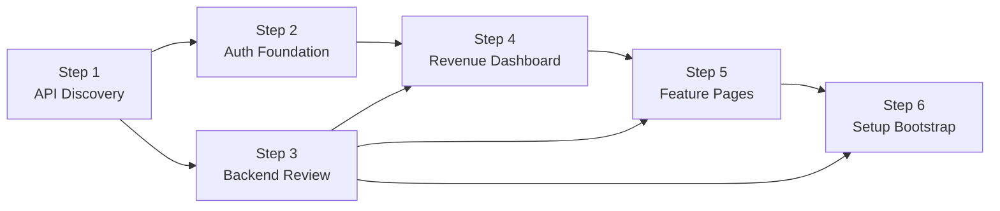

# Astro Portal — Prompt Series

This folder contains the full prompt-driven roadmap to take `astro-portal` from its current state (FastAPI + Vue) to a hardened stack with a new React frontend, a revenue-focused dashboard, a complete feature set, and a zero-friction first-run experience.

Each prompt is self-contained and designed to be pasted into a fresh AI coding session. Run them in order. Do not skip steps — each step's validation criteria assume prior steps are complete and merged.

---

## Conventions used by every prompt

- **Target branch:** `intuitive-design` (commit `d17675511…` or later). Every prompt verifies this up front.
- **No submodules:** the repo has no `.gitmodules`. Do not run `git submodule update`.
- **Structure:** every prompt has the same seven sections — Role, Task / Objective, Context, Example, Constraints, Output Format, Validation Criteria.
- **Scope discipline:** each prompt explicitly lists what it must NOT touch. Scope creep is a validation failure.
- **No emojis** in code, UI copy, logs, commit messages, or docs.
- **`docs/api-audit.md`** produced by Step 1 is the single source of truth for endpoint paths, role requirements, and the frontend page map. Later steps read from it and may only update it with a reconciliation note.

---

## Execution order

| # | Prompt | Role | Changes | Estimated effort |
|---|---|---|---|---|
| 1 | [step-01-api-discovery.md](step-01-api-discovery.md) | Architect (read-only) | `docs/api-audit.md` only | S |
| 2 | [step-02-auth-foundation.md](step-02-auth-foundation.md) | React engineer | new `frontend-react/` app; additive `docker-compose.yml` | M |
| 3 | [step-03-backend-review.md](step-03-backend-review.md) | Backend engineer / security reviewer | `backend/` (routes, security, migrations, CLI, tests); `docs/api-audit.md` §3 reconciliation; `docs/step-03-changelog.md` | M–L |
| 4 | [step-04-revenue-dashboard.md](step-04-revenue-dashboard.md) | React engineer (data-dense UI) | `frontend-react/src/features/dashboard/` + route, providers, deps | M |
| 5 | [step-05-feature-pages.md](step-05-feature-pages.md) | React engineer | `frontend-react/src/features/{customers,visits,solutions,templates,messages,admin,profile}/` + shared primitives | L |
| 6 | [step-06-setup-bootstrap.md](step-06-setup-bootstrap.md) | Platform / DevOps | `docker-compose.yml`, `backend/Dockerfile` + entrypoint, `ops/bootstrap/`, root `.env.example`, `README.md`, `docs/step-06-changelog.md` | S–M |

Effort scale: S ≈ half a day, M ≈ 1–2 days, L ≈ 3–5 days, L+ ≈ a week. Treat as relative, not absolute.

---

## Dependency graph



- **Step 1 unlocks everything.** It is read-only and cheap; do it first.
- **Steps 2 and 3 are independent** once Step 1 is done. If two people are available, run them in parallel.
- **Step 4 requires both 2 and 3.** It builds on the React shell and assumes the backend is hardened.
- **Step 5 requires 3 and 4.** It reuses patterns introduced in Step 4 (format lib, URL-backed state, query layer) and assumes role enforcement matches the audit.
- **Step 6 is last** because it wraps the whole stack in first-run ergonomics. It requires Step 3's idempotent startup and Step 5's final React surface to be in place.

---

## Artifacts produced by the series

By the end of Step 6, the repository contains:

- `prompts/` — this folder, the roadmap itself.
- `docs/`
  - `api-audit.md` — endpoint catalog, role matrix, React page map, gap list, revenue coverage, open questions.
  - `step-03-changelog.md` — backend hardening notes.
  - `step-06-changelog.md` — setup bootstrap notes.
- `backend/`
  - Idempotent `core/startup.py`, `docker-entrypoint.sh`, `cli.py` with `create-admin` and `seed-admin-if-missing`.
  - Tightened schemas, enforced role guards, added migrations, test suite under `backend/tests/`.
- `frontend/` — the original Vue app, unchanged across all six steps.
- `frontend-react/` — the new React + TypeScript + Vite app:
  - Auth shell, route guards, persistent session (Step 2).
  - Revenue Dashboard at `/dashboard` (Step 4).
  - Customers / Visits / Solutions / Templates / Messaging / Admin / Profile (Step 5).
- `docker-compose.yml` — six services plus a `bootstrap` READY sidecar; profiles `with-celery` and `with-nginx` still work.
- Root `.env.example` and `.env`-gitignored — single operator-facing env surface.
- `ops/bootstrap/` — READY-banner sidecar.
- `.gitattributes` — LF enforcement for shell scripts.

---

## First-run experience after Step 6

```
git clone <repo-url> && cd astro-portal
cp .env.example .env           # edit SECRET_KEY, SEED_ADMIN_EMAIL, SEED_ADMIN_PASSWORD
docker compose up --build
# wait for the log line: "astro-portal: READY"
# open http://localhost:5174 and log in as the seeded admin
```

Three commands, one file edit, no second terminal.

---

## How to run a single prompt

1. Confirm the prior step's deliverables exist on the current branch.
2. Open a fresh AI coding session.
3. Paste the entire contents of the step's prompt as your task.
4. Let the agent produce the files and modifications.
5. Walk through the prompt's **Validation Criteria** checklist yourself — do not accept the result until every box is satisfied.
6. Merge. Move to the next step.

---

## Known gaps and intentional non-goals across the series

- **No Next.js / SSR.** The React app is a client-rendered SPA. Justification: this is an internal CRM, SEO is irrelevant, and SSR would complicate the Docker story.
- **No PWA / offline support.** Out of scope; can be added later as an independent step.
- **No E2E tests.** Each step adds unit + integration tests scoped to its surface. A full Playwright suite is a candidate for a future "Step 7 — E2E and CI."
- **No CI/CD pipeline.** Another natural "Step 7" candidate — GitHub Actions running `pytest` + `vitest` + `docker compose build` on every PR, plus a cached first-run smoke test that asserts the READY banner appears.
- **The original Vue app is preserved, not removed.** Decommissioning it can be a "Step 8" once the React surface reaches parity and has been in use for a while.

---

## Future steps (not yet written)

- **Step 7 — CI & E2E.** GitHub Actions: backend pytest, frontend-react vitest, docker compose smoke test asserting `astro-portal: READY` appears within N seconds. Playwright E2E covering login, dashboard, one CRUD flow per domain.
- **Step 8 — Vue Decommission.** Once React reaches parity and soak-tests cleanly, remove `frontend/` and its Compose service; nginx default route points to React; redirect the Vue port for a deprecation window.
- **Step 9 — Observability.** Structured logging (already scaffolded), Prometheus metrics endpoint, OpenTelemetry traces, error tracking via Sentry or equivalent.

Say the word and any of these can be drafted in the same format as Steps 1–6.
